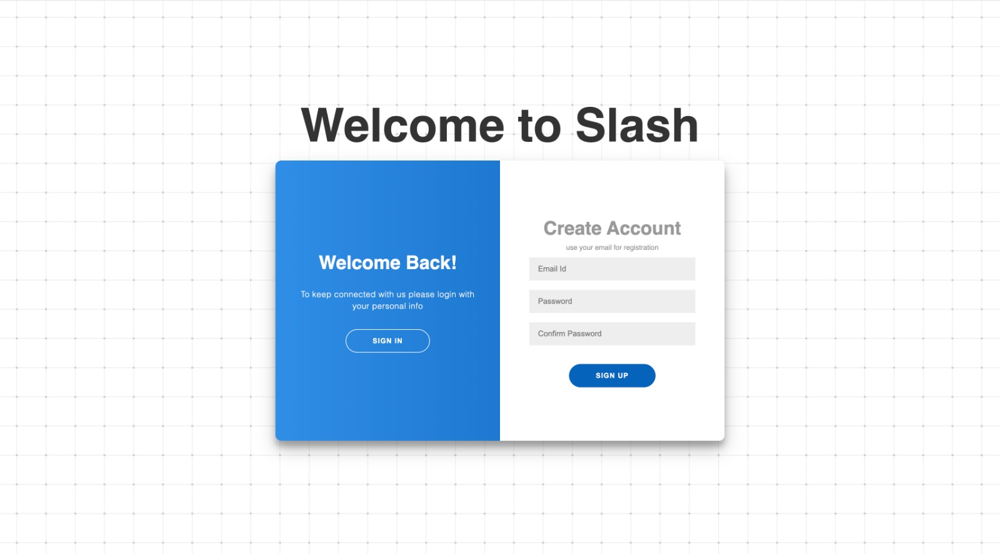
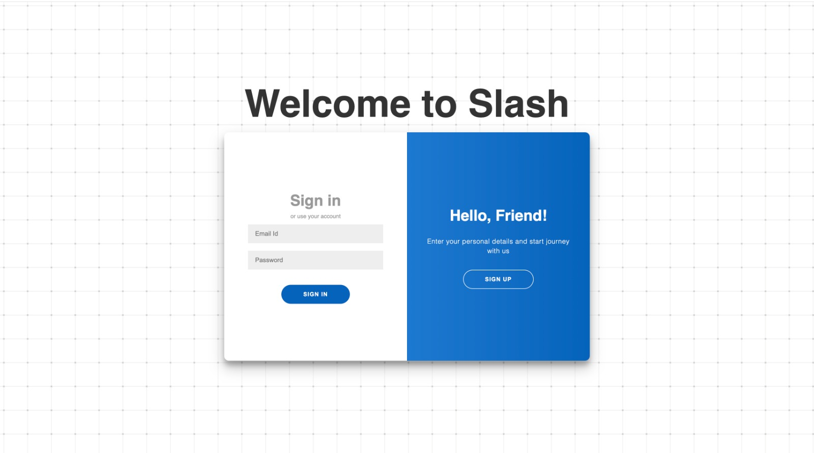
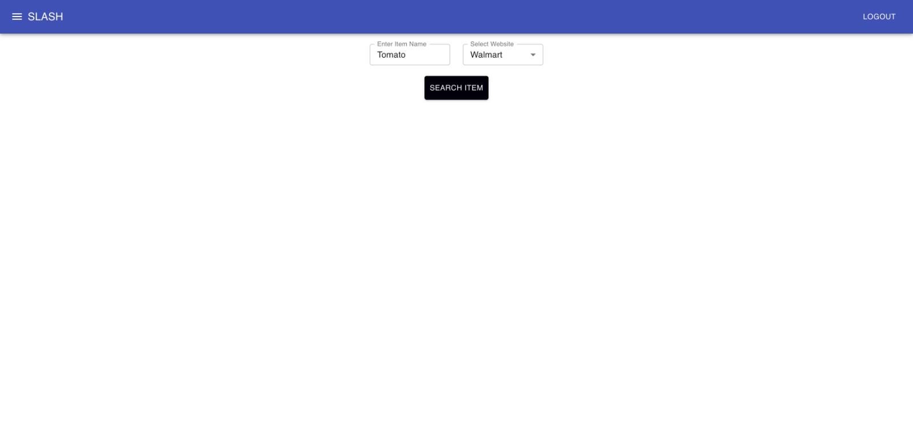
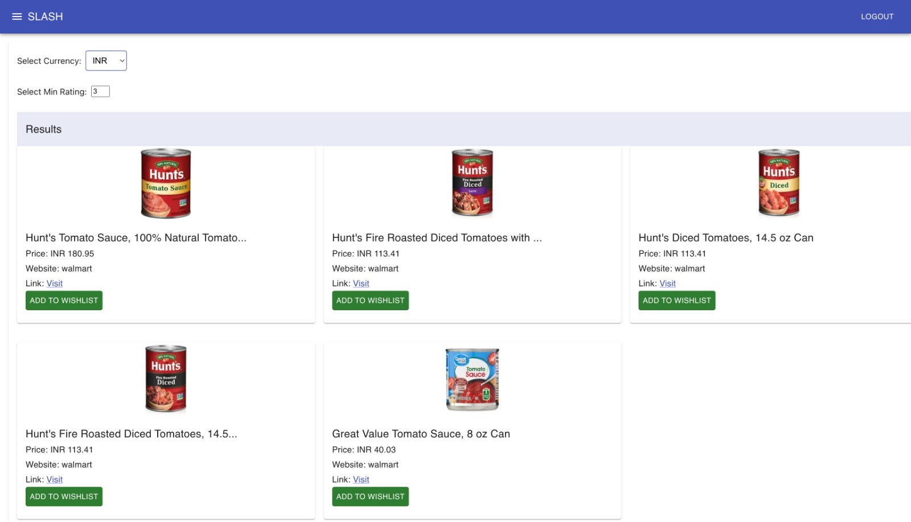
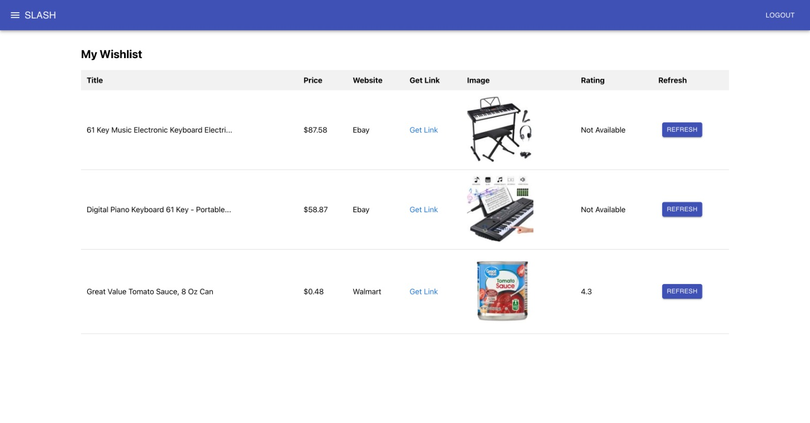
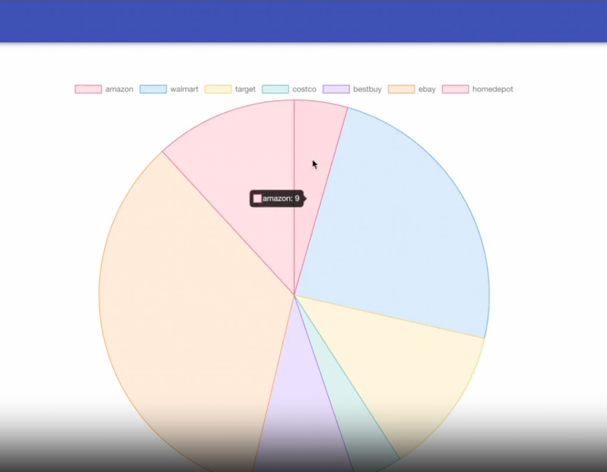
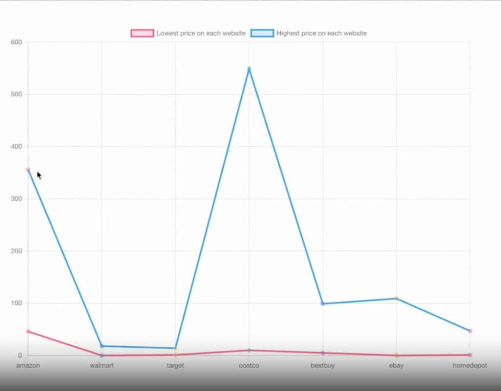

<p align="center"></p>


[](https://doi.org/10.5281/zenodo.10211127)


[](https://codecov.io/gh/nainisha-b/Slash)

On the hunt for incredible online deals? Meet Slash, your savvy shopping sidekick!

Slash, the openly accessible web API framework, empowers you to scour the top e-commerce sites for unbeatable deals on your favorite items across a multitude of online shopping destinations. Currently supported websites include [Amazon](https://www.amazon.com/), [Walmart](https://www.walmart.com/), [Target](https://www.target.com/), [BestBuy](https://www.bestbuy.com/), [Costco](https://www.costco.com/), [EBay](https://www.ebay.com/) and [The Home Depot](https://www.homedepot.com/).

- **Efficient**: Slash streamlines the deal comparison process, potentially saving you more than 50% of your valuable time. The graphs help in making comparisons easily.
- **User-Friendly**: Slash offers user-friendly public APIs for effortlessly filtering, sorting, and searching through search results.
- **Versatile**: It generates JSON responses that you can easily tailor to achieve the specific outcomes you want.
- **Resourceful**: Filter products, view graphs, search and compare products using a single application!

---

## :rocket: What's new? 
## Improvements as a part of Project 2:
We have added various new features to make Slash more efficient and user friendly!

#### 1. Added a Price versus Ratings graph:
- Using this graph, users can quickly identify highly rated products that are available at a cheaper price.
#### 2. Fixed the pricing graph
- Fixed the pricing graph so that the prices are displayed correctly.
#### 3. Fixed the Wishlist
- The wishlist was previously hardcoded which has been fixed by us. Users can now properly add items to wishlist which is stored for future reference.
#### 3. Sorting Button:
- Added a sort button so that users can sort the products based on the prices. This will help in effectively comparing the prices of products. 
#### 4. Item compare feature: 
- Users can use this feature for making a comparison between items for making a better decision while buying a product.
#### 5. Logout feature: 
- The logout feature was previously broken. We have fixed the logout feature so that users can log out.
#### 6. Enhancement of the UI design: 
- We have changed the UI design of the home page and added icons for various options as part of UI enhancement.
#### 7. Test Cases:
- Added test cases for testing the frontend, backend and APIs.

## :page_facing_up: Why

1. **Anti-Web Scraping Measures**
   - **Challenge**: Many popular websites, including Amazon and Walmart, employ anti-web scraping mechanisms, making it difficult to extract data using conventional scraping methods.

2. **Transition to APIs**
   - **Solution**: To overcome this challenge, we've transitioned from traditional web scraping in the backend to leveraging official APIs provided by these websites. This strategic shift not only preserves the project's core functionality but also enhances its robustness.

3. **Enhanced Data Reliability**
   - **Benefit**: APIs deliver data in a structured and reliable format, reducing the risk of unexpected data disruptions. In contrast, web scraping is vulnerable to frequent changes in website structure, which can break scraping scripts. This transition ensures more dependable and consistent data access.

These changes have significantly improved the reliability and sustainability of data retrieval in our project.

Future possibilities encompass the development of web applications with intuitive interfaces and mobile applications for Android and iOS, all powered by these web APIs. Anyone can construct their custom applications atop this foundation of web APIs.".

## Why customers should choose Slash?

- People often look for the best deals with good ratings.
- The widespread availability of internet connectivity has equalized the competitive landscape in retail, enabling both individuals and businesses to market and sell products without being restricted by geographical boundaries. In 2020, e-commerce sales in the United States experienced a substantial 44% growth, largely attributed to the impact of the COVID-19 pandemic. These sales accounted for over 21% of the total retail sales, as reported by the e-commerce data source, Internet Retailer.
- The expansion of e-commerce has not just altered the shopping habits of customers but has also influenced their expectations regarding how brands handle customer service, tailor communications, and offer a variety of choices to customers.
- The competitive environment in the e-commerce market has led to intense rivalry among retailers, evident in the pricing strategies adopted by major market players. Discounts and price reductions have become common, and securing the most favorable deal for your money can occasionally be challenging, even in the realm of online shopping.
- This is what Slash aims to reduce by giving you an easy to use, all in one place solution for finding the best deals where users have an oppurtunity to filter products based on the rating and cheapest prices.
- The updated version of Slash has currency conversion which is very important now-a-days as users want to know the prices of the products in their home currency.
---

<p align="center">
  <a href="#movie_camera-checkout-our-video">Checkout our video</a>
  ::
  <a href="#rocket-installation">Installation</a>
  ::
  <a href="#computer-technology-used">Technology Used</a>
  ::
  <a href="#bulb-use-case">Use Case</a>
  ::
  <a href="#file_cabinet-api">APIs used in the Project</a>
  ::
  <a href="#golf-future-roadmap">Future Roadmap</a>
  ::
  <a href="#sparkles-contributors">Contributors</a>
  ::
  <a href="#email-support">Support</a>

</p>

---
## :movie_camera: Login/Log out:
### 1. Create Account:
<p align="center"></p>

### 2. Sign in:
<p align="center"></p>


## :movie_camera: Web-Application Results:
### 1. Search items:
- Users can select an item from a particular website like Amazon, Walmart from the drop box.
<p align="center"></p>

### 2. Filtering Products and Currency conversion:
- The results are displayed based on the users ratings and the selected currency. Users can add their products to the wishlist.
<p align="center"></p>

### 3. Wishlist:
- The results show that users can successfully add their products to the wishlist and can refresh to see the updated prices.
<p align="center"></p>

### 4. Graphs:
- The results of the graph show the lowest price and highest price of the product on each website.
<p align="center"></p>
<p align="center"></p>

## :movie_camera: Checkout our videos
Why Slash? Why choose our product? Check our vedio out!!

https://github.com/nainisha-b/slash/assets/54759065/3d106a3f-263e-4b2d-b003-3083351cd8b5

Check the complete implementation of our project!

https://github.com/nainisha-b/SEProject510/assets/54759065/826e0739-cb17-492e-8cd4-1dc2b94f3ad6

Also, you can watch the video demo of the Slash project with audio explanation and more clarity here https://youtu.be/skk1FX9sCAU.


---

## : Requirements
1. [Visual Studio Code](https://code.visualstudio.com/download)
2. [Python 3.7 and above](https://www.python.org/downloads/)
3. [Node.js](https://nodejs.dev/en/download/) and NPM
4. [MySQL Workbench](https://dev.mysql.com/downloads/mysql/)

## :rocket: Installation

## 1. Clone the Repository
- Clone the Github repository to a desired location on your computer. You will need [git](https://git-scm.com/) to be preinstalled on your machine. Once the repository is cloned, you will then `cd` into the local repository.

```
git clone -b release/2.0.0 git@github.com:MasterShifu619/Slash.git
cd slash
```

## 2. Python installation
- This project uses Python 3 for the backend and React along with Javascript framework for the frontend. This project employs MySQL Workbench to authenticate the users hitting on the frontend.
  
For the backend setup ensure that [Python](https://www.python.org/downloads/) and [Pip](https://pip.pypa.io/en/stable/installation/) are preinstalled. All the python requirements of the project are listed in the `requirements.txt` file. Use pip to install all of those.

```
pip3 install -r requirements.txt
```
## 3. Node Setup for Front-end 
- For the frontend setup ensure that [Node](https://nodejs.org/en/) is preinstalled.

```
Install node 18.17.1 #installing older version of node.js
```

- All the node requirements are listed in `client/package.json` file. Use npm to install all of those.

```
cd client
npm install --legacy-peer-deps
```

- For the login page setup, to install all the requirements which are listed in 'LoginPage/package.json' file. Use npm to install all of those.

```
cd LoginPage
npm install express
npm install mysql
npm install cors
npm install nodemon
```
- In login page, go to services.js and update line 72 the cwd with your folder where npm start should be executed.

#### Common Error faced:
```
cd slash
cd package.json
```
- For Mac:
In scripts line 72 change the start, give the value as "start": "react-scripts --openssl-legacy-provider start",

## 4. Setting Up SQL Work Bench:
For MySQL Workbench setup, 
- Importing db schema
   <p align="center"></p>
- Changing db credentials from services.js
   <p align="center"></p>

- Facing Issues?
Refer to the this [Stack Overflow](https://stackoverflow.com/questions/50093144/mysql-8-0-client-does-not-support-authentication-protocol-requested-by-server) Link resolution
   
## 5. Run the application:

1. Once all the requirements are installed, you will have to `cd` into the `src` folder. Once in the `src` folder, use the python command to run the `main.py` file.

```
cd src

For Mac
python3 main.py

For Windows
python main.py
```

2. Once the backend is up and running, you will have to `cd` into the `LoginPage` folder. Once in the `LoginPage` folder, use the node command to start the webserver.

```
cd LoginPage
nodemon services.js

Open Login.html in the web browser
```


## :computer: Technology Used

- FastAPI : https://fastapi.tiangolo.com
- Unwrangle API: https://www.unwrangle.com/
- ASGI Server - Uvicorn : https://www.uvicorn.org


## :bulb: Use Case

- **_Students_**: Students coming to university are generally on a budget and time constraint and generally spend hours wasting time to search for products on Websites. Slash is the perfect tool for these students that slashes all the unnecessary details on a website and helps them get prices for a product across multiple websites.Make the most of this tool in the upcoming Black Friday Sale.
- **_Data Analysts_**: Finding data for any project is one of the most tedious job for a data analyst, and the datasets found might not be the most recent one. Using slash, they can create their own dataset in real time and format it as per their needs so that they can focus on what is actually inportant.

## :file_cabinet: API

Here are the APIs used in our project:

- **Amazon**: [Amazon API Documentation](https://www.rainforestapi.com/)

- **Walmart**: [Walmart API Documentation](https://www.bluecartapi.com/walmart-product-data-api)

- **Target**: [Target API Documentation](https://www.redcircleapi.com/target-product-data-api)

- **The Home Depot**: [The Home Depot API Documentation](https://www.bigboxapi.com/)

- **Ebay**: We used the Ebay SDK, which can be found in the project's requirements. Please refer to the SDK's official documentation for more information.

  - **Ebay SDK Documentation**: [Ebay SDK Documentation](https://developer.ebay.com/support/kb-article?KBid=84)

- **saveCart**:
   It is associates the following function with the specified URL endpoint ("/api/saveCart") and HTTP method (POST) that specifies the save_cart 
   function to handle these requests.
  
 - **getAllItems**:
   It associates the following function with the specified URL endpoint ("/api/getAllItems") and HTTP method (GET). So, when a client makes a GET request to 
   "/api/getAllItems," the get_all_items function is called, and it returns a JSON response with a list of  items. 
      
   Please refer to these API documentation links for details on how to use them in our project.

## :golf: Future Roadmap

1. Adding more filtering options on the basis of brands, sellers, product categories and delivery dates.
2. Constant price tracking option to track huge discounts and sales on various ecommerce websites.
3. Notifying users of price drops, sales and customized products on the registered email ids.
4. Enchancing the security of the application.
5. Enhancing the User Interface more.
6. Adding more ecommerce websites like Chewy, Kroger, Walgreens etc
7. Increasing the number of test cases to improve code coverage.

# Team Members
- [Bipin Gowda](https://github.com/MasterShifu619)
- [Isha Dave](https://github.com/IshaDave26)
- [Ashlesha Joshi](https://github.com/aj18coep)


## :email: Support

For any queries and help, please reach out to us at: joshiashlesha987@gmail.com
